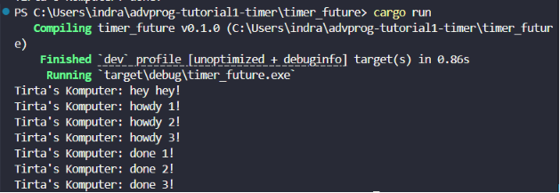
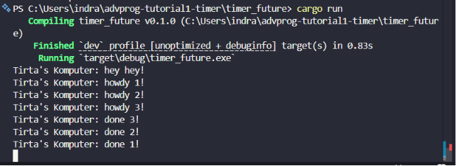

# Tutorial 1: Timer

## Experiment 1.1: Original timer from the book

### What I did
I implemented a simple asynchronous timer and executor based on the Rust Async Book. The program creates a `TimerFuture`, spawns it into a custom executor, waits for two seconds, and then continues execution.

The program prints howdy first because the async task starts running when the executor polls it. After that, TimerFuture::new(Duration::new(2, 0)).await returns Poll::Pending, so the executor waits until the waker is called. The timer thread sleeps for two seconds, marks the shared state as completed, and wakes the task. After being woken, the task is polled again and prints done. This shows that a future does not complete immediately, but needs to be driven by an executor.

## Experiment 1.2: Understanding how it works

### What I changed
I added a new print statement right after `spawner.spawn(...)` and before `executor.run()`.

### Result

### Explanation
The text `hey hey` is printed before `howdy` because `spawner.spawn(...)` does not immediately execute the async block. It only wraps the future into a task and sends it into the executor queue. The future starts running only when `executor.run()` receives the task and polls it. This proves that futures in Rust are lazy. They need an executor to make progress.

## Experiment 1.3: Multiple Spawn and removing drop

### What I changed
I spawned three async tasks instead of one. I also tested the behavior of the executor when `drop(spawner)` is removed and then added back.

### Result

### Explanation
Multiple spawn means multiple top-level futures are submitted to the executor queue. Each task prints its first message, waits using `TimerFuture`, then continues after the timer wakes it. The executor polls tasks from the queue and lets each task make progress when it is ready. The `spawner` is responsible for sending tasks into the queue, while the executor is responsible for receiving and polling them. When `drop(spawner)` is removed, the channel remains open, so the executor keeps waiting for more incoming tasks and the program does not terminate normally. Therefore, `drop(spawner)` is needed to tell the executor that no more tasks will be sent.

